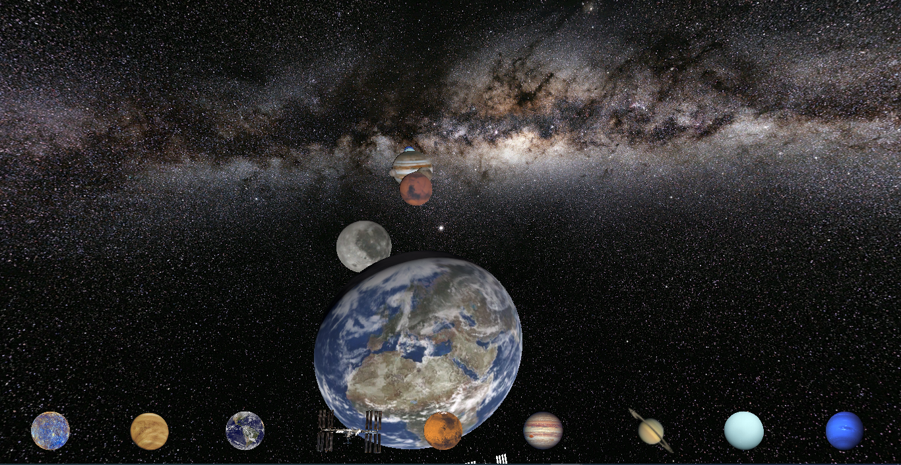
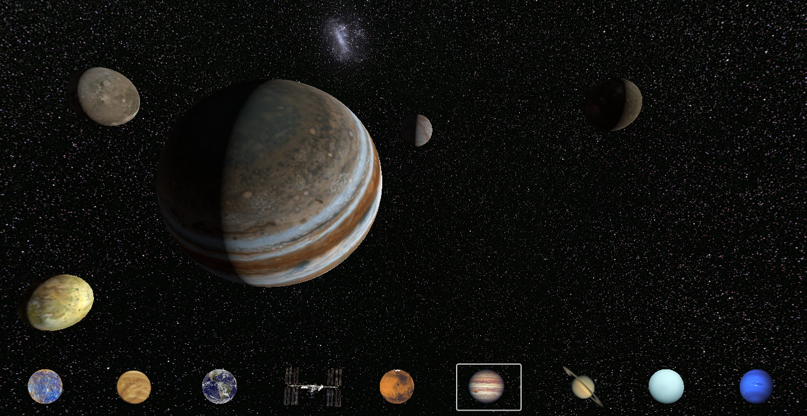
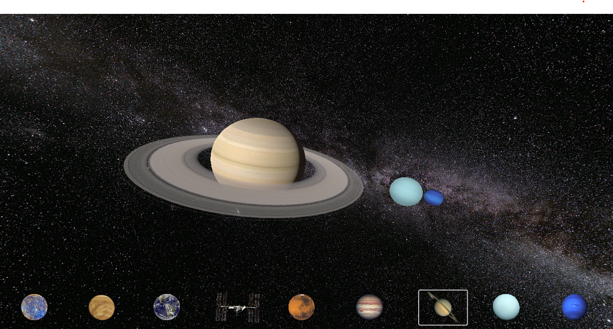
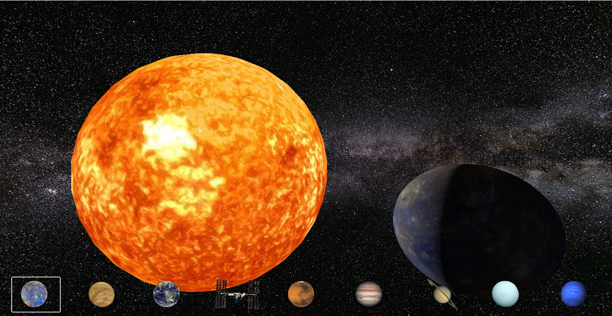

# Solar-System-Simulation
Explore the beauty and complexity of our solar system in this Godot-based simulation project. Witness the orbits of planets, the radiance of the sun, and the celestial dance of the cosmos right on your screen.🌌🪐🌞

## Project Description

This project is a Solar System Simulation developed in Godot, offering a visual representation of the celestial bodies within our solar system. It provides an educational and immersive experience to learn about the planets, their orbits, and their relative sizes. The simulation uses accurate data and physics to depict the solar system as realistically as possible.

## Screenshots

Here are some snapshots from the Solar System Simulation:

1. 
   

2. 
  

3. 
   

4. 

5. 

## Getting Started
To run this simulation on your local machine, follow these steps:

1. Clone this repository:
2. Open the project in the Godot game engine.
3. Explore and enjoy the wonders of the solar system!
4. 
## Contributing

We welcome contributions! If you'd like to enhance this project, please:

- Fork the repository
- Create a new branch
- Make your changes
- Submit a pull request
  
## License

This project is licensed under the MIT License - see the [LICENSE](LICENSE) file for details.

